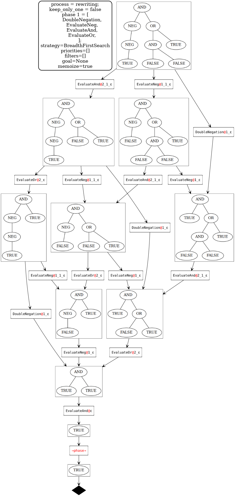

# Basic term rewriting utilities to rewrite concrete tree terms according to a set of rules

I initially wrote this code for this project: [hibou](https://github.com/erwanM974/hibou_label).

Since then it has evolved a bit and I decided to repackage it on its own as a library.

This does not claim to be a fully fledged Term Rewriting Library.
By that I mean that:
- only concrete terms are intended to be handled (i.e., in the term structure, there are only concrete terms, and no placeholders for "unknown" subterms)
- the final user must provide the rewrite system as a finite set of rules by picking and choosing among a predefined set of rules (either builtin or specified by the library user)
- the provided rules are only applied blindly following a certain heuristic. There are no checks on the termination or confluence of the rules. As a result:
  - if you provide a set of rules that is non terminating, when applying them on a term, the process might:
    - terminate if and only if you memoize all encountered terms. In that case, this means you have at least one cycle of rewrite operations.
    - not terminate at all, even if you memoize (trivially, if you have a rule like `c -> F(c)`)
  - if you provide a set of rules that is non confluent, and if you generate the rewrite graph of a concrete term (memoizing encountered terms), there may not be a unique irreducible term in that graph.

## Barebones interface

In "src/core", the barebones generic interface is provided.

The library user must provide the type of the operator symbols (i.e., the signature of the formal language the user wants to apply rewriting to).

The notions of terms and positions in those terms are implemented by dedicated data types in "src/core".

As for the rewrite rules, they are represented by a Generic Trait with a "try_apply" function that tries to apply it to a specific (sub)term, returning the result as an Option.

The library user must enumerate the rules and provide an implementation for the "try_apply" function.

The user may then use the resulting system to rewrite concrete terms.
In "src/process", this process is automatized, with the possibility to parameterize it in various manners
(based on [graph_process_manager_core](https://crates.io/crates/graph_process_manager_core) and [graph_process_manager_loggers](https://crates.io/crates/graph_process_manager_loggers)).

As a result, we benefit from (among others) the visualization of the rewriting process as a Graphviz graph.
Let us remark, that the visualization of each individual term as a tree is implemented in "src/draw_term".

### Barebones only example

In "str/tests/barebones_only" a small example that makes only use of the crate's barebones interface is given.

Below is an output produced by a graphviz logger connected to the rewriting process.

In the example process below all paths are computed but we can choose to only compute one.

Of course, depending on the way with which you define the rules, the system is not necessarily guaranteed to be terminating/confluent/convergent.
To check that, you should use a dedicated tool (it is not handled here).

## Builtin extended interface

TODO 

### Examples using the extended interface

TODO 

